# Customize your wireless keymap

## Overview

This guide provides instructions on how to use the `keymap-editor` web application in combination with GitHub to customize and flash your keyboard running [ZMK firmware](https://zmk.dev).

For demonstration purposes, this guide uses the `Sofle Choc 59-key keyboard` as an example. However, the same process applies to **any keyboard powered by ZMK**.

Repository links for each of my keyboards are available in their respective listings. If you cannot locate the repository for your specific keyboard, do not hesitate to contact me.

 

This guide applies exclusively to wireless keyboards running [ZMK firmware](https://zmk.dev).

If you are using a wired keyboard, please note that my wired builds are flashed with Vial-QMK. For those keyboards, download and use the Vial application instead.

 

> Note: All of my keyboards now come pre-flashed with ZMK Studio, allowing you to modify your basic keymap directly from your web browser — no re-flashing required.
> 
> However, this tool only allows you to remap keys that are already defined within your existing keymap.
>
> For advanced customizations — such as adding combos, macros, or modifying encoder mappings — please follow the instructions provided in the guide below.

 

### Keymap Editor

The following image is an example of how the Keymap Editor interface looks.

  
Click to expand

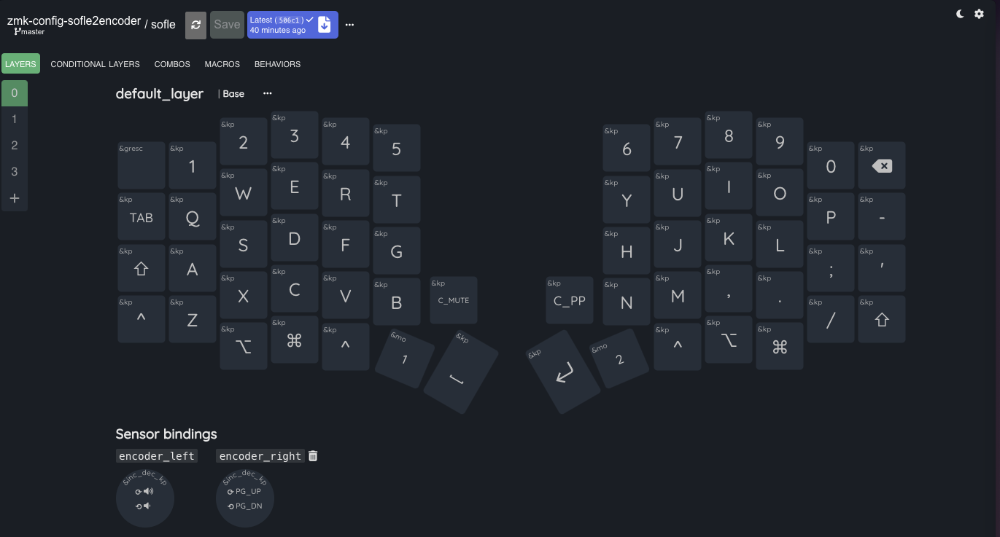

----

## Build a new firmware

1 . Navigate to my GitHub profile and locate the repository corresponding to your keyboard.

- [Full size 42 key Corne and Corne Choc](https://github.com/KeyboardHoarders/zmk-config-corne)
- [Mini 36 key Corne and 36 key Corne Choc (when using keymap-editor you will see the extra columns but can ignore these)](https://github.com/KeyboardHoarders/zmk-corne-mini)
- [Sofle and Sofle Choc with 2 encoders](https://github.com/KeyboardHoarders/zmk-config-sofle2encoder)
- [Sofle Choc 59 key 1 encoder](https://github.com/KeyboardHoarders/zmk-sofle59key)
- [Sofle Choc 60 key 0 encoders](https://github.com/KeyboardHoarders/zmk-soflechoc-60key)
- [Lotus58 Wireless](https://github.com/KeyboardHoarders/zmk-config-lotus58)
- [Totem Wireless](https://github.com/KeyboardHoarders/zmk-totem-config)
- [Lily58 Wireless](https://github.com/KeyboardHoarders/zmk-config-lily58)
- [Allium58](https://github.com/KeyboardHoarders/zmk-config-allium58)

----

2 . While signed in to your GitHub account, fork the repository corresponding to your keyboard.

  
Click to expand

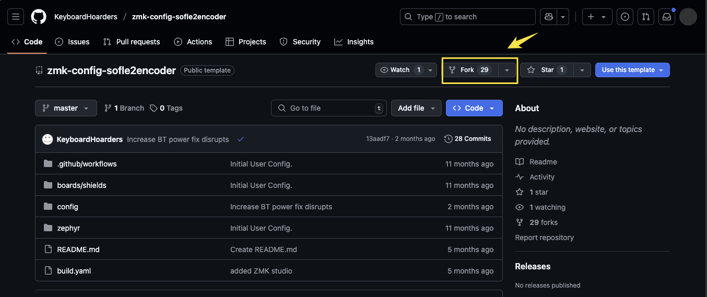

----

3 . Navigate to your newly forked repository and click on the Actions tab.

  
Click to expand

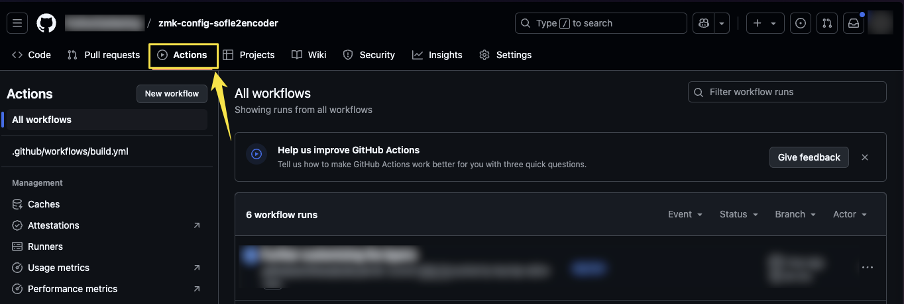

----

4 . Click the button labeled "I understand my workflows".

  
Click to expand

----

5 . From the top-left menu, select `.github/workflows/build.yml`.

  
Click to expand

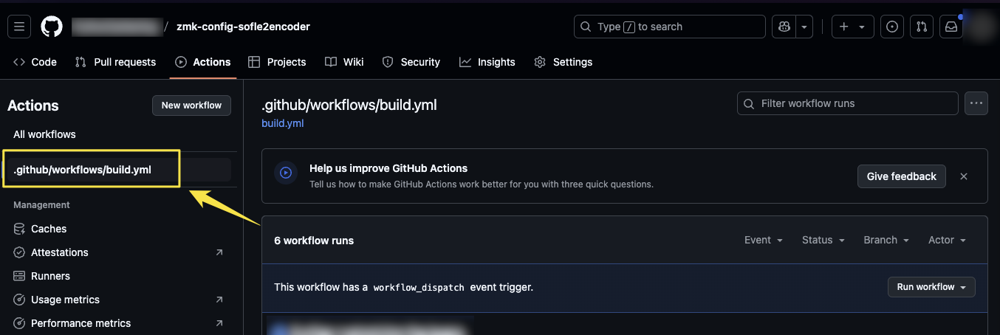

----

6 . Select Run workflow, then choose Use workflow from Branch: master, and click `Run workflow` to execute the process.

  
Click to expand

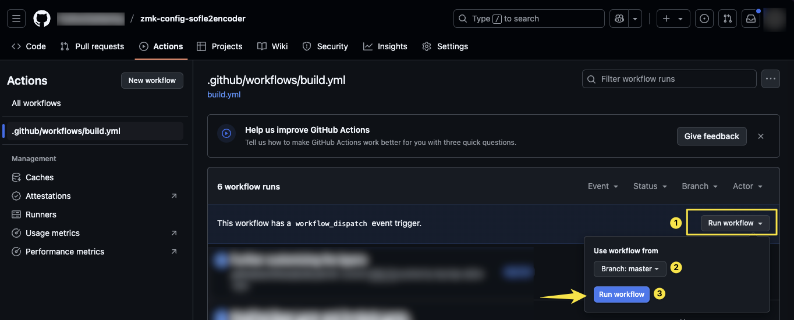

----

7 . Return to `All workflows` under the `Actions` tab and wait for the workflow to complete successfully (It will turn green or blue upon completion, depending on the theme you have selected).

This step ensures that you have a stable, working keymap to fall back on if needed.
It is highly recommended to avoid making too many changes initially. 
Complete this step first, and once the workflow finishes successfully (green), you can proceed with more advanced customizations.

  
Click to expand

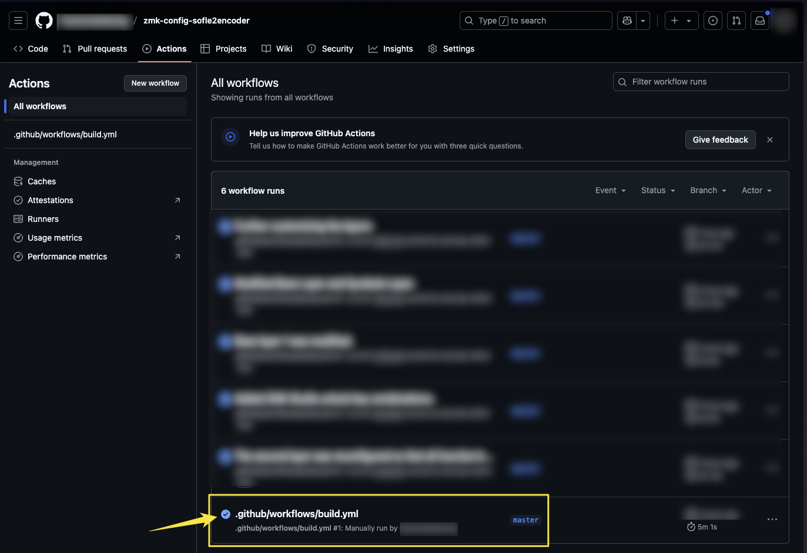

----

8 . Once the workflow completes successfully (status turns green), it means your configuration compiled without errors.

If the workflow fails (status turns red), it likely indicates an issue with your changes.
In that case, I recommend reverting to the default configuration and applying small, incremental changes to help identify the problem.

Next, navigate to the [Keymap Editor](https://nickcoutsos.github.io/keymap-editor/):

Follow these steps:

1. Log in using your GitHub account and authorize access if prompted.
2. Select Only select repositories when asked for repository access.
3. In the Select repositories drop-down, search for the repository you forked.
4. Click Install to grant access.

  
Click to expand

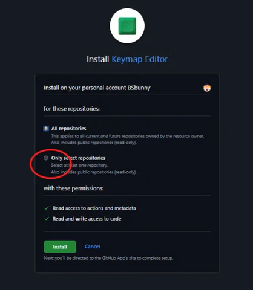

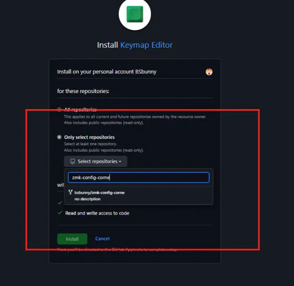

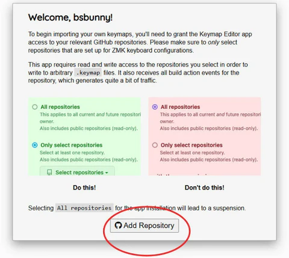

----

9 . This will reload the page and display a user-friendly interface where you can start customizing your keymap as needed.

**Important**: I do not recommend spending a long time making extensive changes right away. 
For example, if you want to experiment with macros, start by adding a single macro, save your changes, and compile.
If the build succeeds, you can confidently proceed with additional changes.

----

10 . Click the Save button at the top of the page, then select Commit when the confirmation dialog appears.

  
Click to expand

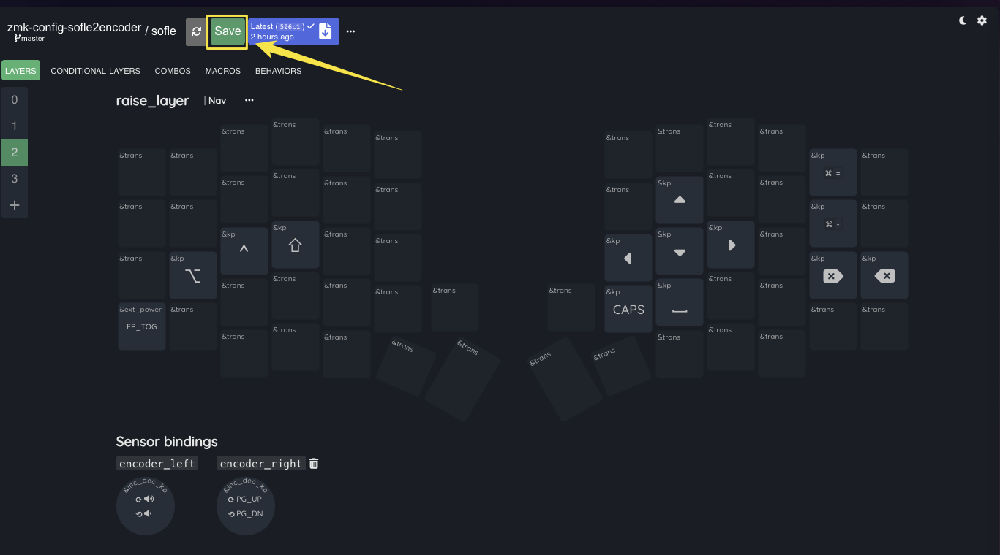

----

11 . Return to your GitHub repository and navigate to the Actions tab. You should see a new workflow automatically running.

Wait for the workflow to complete. As long as the status turns green (or blue, depending on your selected theme),
it means all changes have successfully compiled without errors.

  
Click to expand

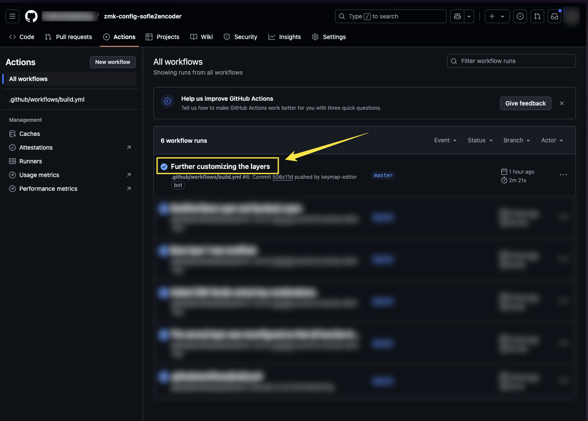

----

12 . Select the completed workflow highlighted above within the red box. Then, download the generated ZIP file and extract its contents.

  
Click to expand

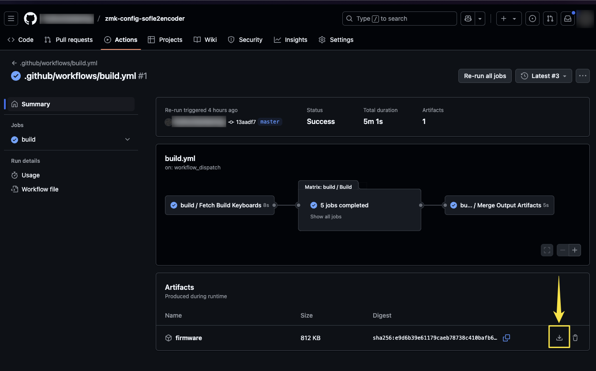

----

13 . For the next steps, ensure that both halves of the keyboard remain powered on throughout the entire process.

13.1 . Start by plugging in the left half of the keyboard.  

13.2 . Once connected, press the physical reset button twice — this button is located next to the on/off slide switch.  

13.3 . This action will place the keyboard into bootloader mode and automatically open a new directory on your computer.  

13.4 . Open this newly created directory and drag and drop the settings_reset file (highlighted in the green box in the image) into it.  

  
Click to expand

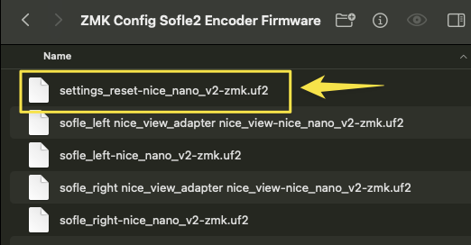

13.5 . Next, unplug the left half of the keyboard and connect the right half. Once connected, press the physical reset button twice to enter bootloader mode.  

13.6 . Drag and drop the same settings_reset file (highlighted in the green box) into the directory of the right half of the keyboard.  

13.7 . Now plug the left half of the keyboard back in.  

&nbsp;&nbsp;&nbsp;&nbsp;13.7.1 If your keyboard has displays, drag and drop the sofle_left-nice_view file (highlighted in the red box) into the directory.  
&nbsp;&nbsp;&nbsp;&nbsp;13.7.2 If your keyboard does not have displays, use the sofle_left-nice_nano file instead.  

13.8 . Next, unplug the left half of the keyboard and connect the right half. Press the reset button twice to enter bootloader mode.  

&nbsp;&nbsp;&nbsp;&nbsp;13.8.1 If your keyboard has displays, drag and drop the sofle_right-nice_view file (highlighted in the red box) into the directory.  
&nbsp;&nbsp;&nbsp;&nbsp;13.8.2 If your keyboard does not have displays, use the sofle_right-nice_nano file instead.  

13.9 . Next, on your computer or device, navigate to your Bluetooth settings and locate the list of previously paired devices.  

&nbsp;&nbsp;&nbsp;&nbsp;13.9.1 Look for a Sofle device — it may appear as not connected or it might briefly show as connected before disconnecting.  
&nbsp;&nbsp;&nbsp;&nbsp;13.9.2 Remove (forget/delete) this device from your Bluetooth list to clear the previous pairing information.  

  
Click to expand

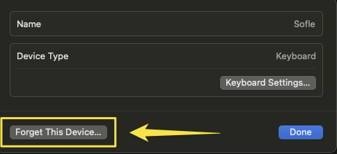

13.10 . Finally, pair the keyboard as a new device from your Bluetooth settings.  

----

# References

- [Keyboard Hoarders - Guide #1](https://keyboard-hoarders.com/pages/guides-1)